# Anomaly detection in medicare claims

Medicare is a single payer national social insurance program administered by the United States(U.S.) federal government. It provides health insurance to Americans aged 60 and above, and also sections of younger demographic who have disability or end stage disease related ailments as determined by the U.S. Social Security Administration. With age and disability of its target group contributing to the subjects' diminished income prospects, how can Medicare justify its paying on average only 31%(2015) of the billed amounts? 

Low insurance payments would drive one to expect a paucity in funding, which however is not the case as U.S. total health spending is about 17% of its GDP. Medicare alone receives about $600 billion. One must also view these statistics in light of health care fraud allegations with multi-million dollar tags. According to Donald Berwick, a former head of the Centres for Medicare and Medicaid Services (CMS), and Andrew Hackbarth of the RAND Corporation, more than 10% of medicare funding might have been paid to fraudulent claims. Fraud detection is traditionally handled by a number of business rules that describe anomalies. However, such rules are hard to evolve to detect changing patterns, especially with the possibility that the fraudsters can learn to circumvent the rules. Thus, the enormity of this situation builds a case for efficient machine learning algorithms that can detect anomalous claims and estimate fair insurance payments. In this study I explore similarity based outlier detection to classify/ flag anomalous practitioners and compare the performance of various machine learning regression algorithms in predicting overcharge ratios.

# Data description

This study uses the 2015 "Medicare Part-B" dataset published by CMS that contains information on about 9497892 claims made by Physicians from all over the U.S. Illinois is the geographical unit of interest for this study, and this accounts for about 802923 claims. Features of interest in this dataset are,

1. Individual or organisation
2. Department of medicine
3. Clinic or non-clinic
4. Service description
5. No. of services provided
6. No. of beneficiaries covered
7. No. of distinct beneficiaries/ pay
8. Avg. medicare allowed amount for services provided
9. Avg. medicare payments
10. Avg submitted charges

Additional information about the physicians, such as data from patient surveys and clinician reported performance rates, will be used for extra features.

Overcharge ratio is arrived at with the formula, 1 - Avg. medicare payments/Avg submitted charges. High overcharge ratio could be an indicator of an inflated/ fraudulent claim.

# Exploratory data analysis


```python
import os
import pandas as pd
import numpy as np
import matplotlib.pyplot as plt
from sklearn.metrics import r2_score, mean_squared_error
from sklearn.model_selection import train_test_split
import pandas as pd
import pickle
import sys

%matplotlib inline

DATA_FOLDER = os.path.join('..', 'data')
with open(os.path.join(DATA_FOLDER, 'cleaned_data.pickle'), 'rb') as handle:
    df_claims = pickle.load(handle)
    
with open(os.path.join(DATA_FOLDER, 'raw_data.pickle'), 'rb') as handle:
    df_raw_claims = pickle.load(handle)
```

Let us look at the distribution of overcharge across various feature ranges. 


```python
fig = plt.figure(figsize=(7,5))

plt.hist(df_claims['overcharge_ratio'])
plt.xlabel('overcharge_ratio')
plt.ylabel('count')
fig.suptitle('Overcharge ratio')
plt.show()
```


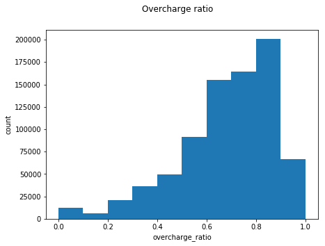


We see that overcharge_ratio is skewed to the left. It also looks a bimodal distribution. Is the observed overcharge ratio uniform across the claim amounts or do they differ across claim amount bands?


```python
fig = plt.figure(figsize=(7,5))

plt.hist(df_claims['overcharge_ratio'], weights=df_claims['avg_submitted_charge_amt'], bins=np.arange(0,1, 0.1))
plt.xlabel('overcharge_ratio')
plt.ylabel('avg_submitted_charge_amt')
fig.suptitle('Overcharge ratio')
plt.show()
```


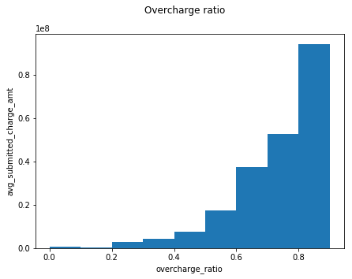


We see that higher claim amounts have higher overcharge ratios. Is there a pattern in across the departments?


```python
ax = pd.DataFrame(df_claims.groupby('department')['overcharge_ratio'].mean()).plot(kind='bar', figsize=(20,15), title='Department vs Overcharge ratio')
ax.set_ylabel('overcharge_ratio')
```


    <matplotlib.text.Text at 0x1f14682b0>


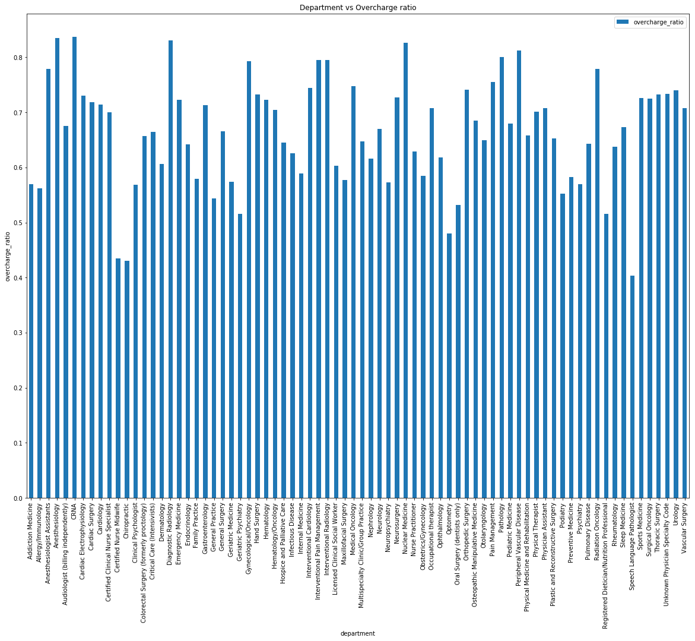


```python
ax = pd.DataFrame(df_claims.groupby('department')['avg_submitted_charge_amt'].sum()).plot(kind='bar', figsize=(20,15), title='Department vs Claims')
ax.set_ylabel('claim amount')
```


    <matplotlib.text.Text at 0x10e64ccf8>


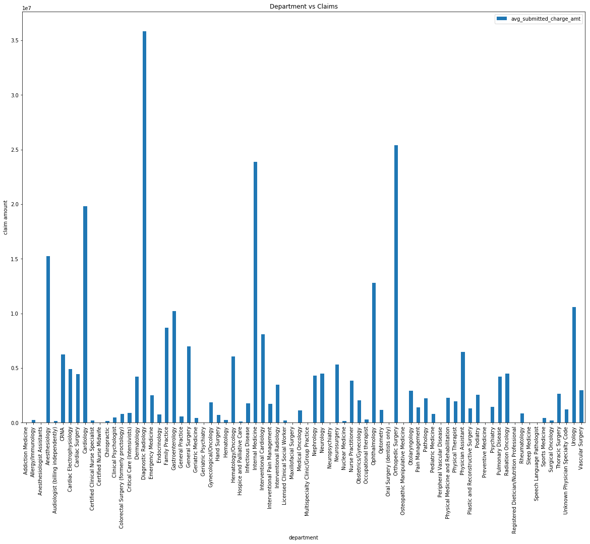


```python
ax = pd.DataFrame(df_claims.groupby('department')['avg_medicare_payment_amt'].sum()).plot(kind='bar', figsize=(20,15), title='Department vs Payments')
ax.set_ylabel('payments')
```


    <matplotlib.text.Text at 0x10e79bda0>


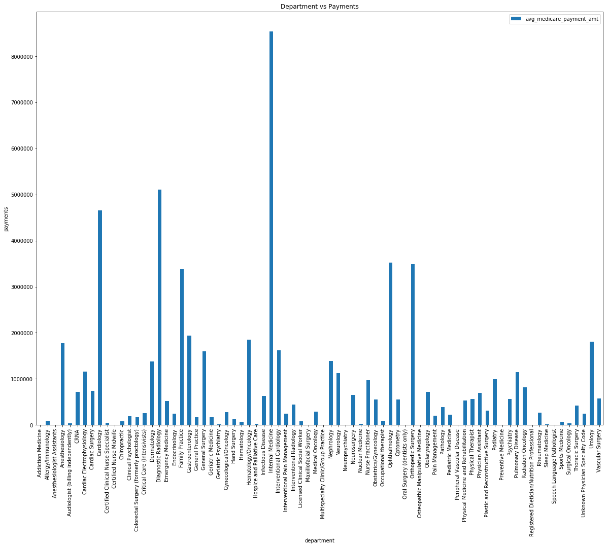


Departments that claim high amounts also receive the most payments. They also seem to have high overcharge ratios. The graphs above also point to interactions/ non linear relationships between departments, claim amounts and overcharge ratios.


```python
df_raw_claims['overcharge_ratio'] = df_claims['overcharge_ratio']
```

Exploring with the names of the providers to see if we can identify the physicians involved in high profile fraud cases,


```python
ax = pd.DataFrame(df_raw_claims.groupby('name')['Average Medicare Payment Amount'].sum().nlargest(20)).plot(kind='bar', figsize=(20,15), title='Provider vs Payments')
ax.set_ylabel('payments')
```


    <matplotlib.text.Text at 0x1f0e47470>


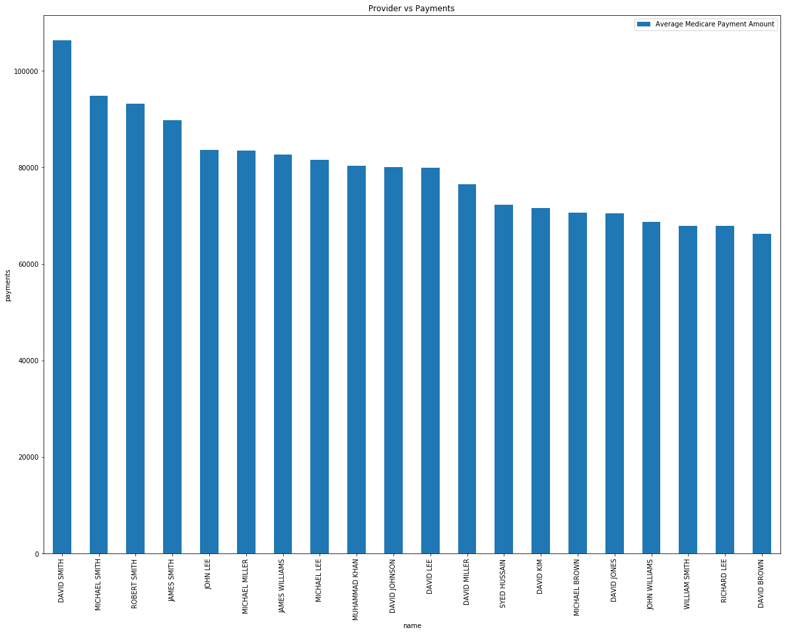


Plotting providers who have near full payment rates, we see that the claim amounts are less than $ 1 Million.


```python
ax = pd.DataFrame(df_raw_claims.loc[df_raw_claims['overcharge_ratio'] < 0.2].groupby('name')['Average Medicare Payment Amount'].sum().nlargest(10)).plot(kind='bar', figsize=(20,15), title='Provider vs Payments')
ax.set_ylabel('payments')
```


    <matplotlib.text.Text at 0x1cfd5e748>


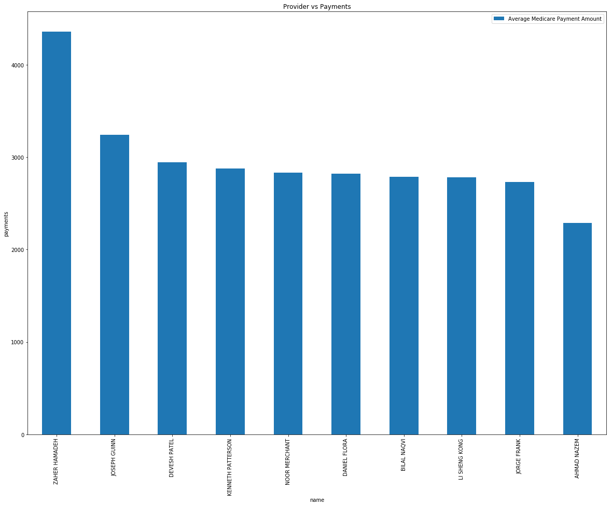


Checking for providers whose claims were mostly rejected, we find names who seem to have low online reviews.


```python
ax = pd.DataFrame(df_raw_claims[df_raw_claims['overcharge_ratio'] < 1].groupby('name')['Average Submitted Charge Amount'].mean().nlargest(10)).plot(kind='bar', figsize=(20,15), title='Provider vs Payments')
ax.set_ylabel('payments')
```


    <matplotlib.text.Text at 0x172118748>


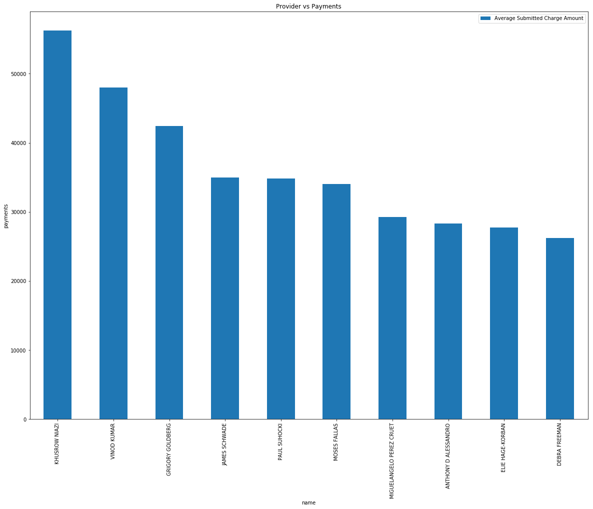


# Distribution of services provided across physicians and anomalies

Claim and payment values in each record of claims dataset are average values for the associated physician for a unique service code. Each code corresponds to a diagnosis or service performed by the doctor. Medicine departments typically have sets of codes that are more popular within departments, and hence it contributes to an internal structure in the dataset. One flavour of anamolous claims can be a doctor from a medicine department claiming for services not very common for their department. This can be implemented in two steps,

1. Compute similarity measures (cluster diameters) of codesets of a physician with their department mates'. CountVectorization can be used to compute text similarity.
2. Estimating outliers from the resultant univariate distance metric, using mean and median based measures.

The above procedure yielded findings such as below.


```python
def calculate_code_cluster_diams(df_claims, identifier_col, code_col):

    def compute_cutoff(level, cys):
        for i in range(len(cys), 0, -1):
            if cys[i - 1] < level:
                return i
        return -1

    def get_department_cutoff(df_cluster):
        counts, bins, ignored = plt.hist(df_cluster['code_cluster_diam'], bins=100)
        cumsums = np.cumsum(counts)
        max_cy = df_cluster.shape[0]
        strong_xcut = compute_cutoff(0.99 * max_cy, cumsums) / len(bins)
        mild_xcut = compute_cutoff(0.95 * max_cy, cumsums) / len(bins)
        return {'dept_strong_cut': strong_xcut,
                'dept_mild_cut': mild_xcut
                }

    EPSILON = 0.1

    df_physicians_and_cpts = pd.DataFrame(
        (df_claims.groupby(identifier_col)[code_col].unique().agg(lambda col: ' '.join(col))).reset_index())

    vec = CountVectorizer(min_df=1, binary=True)
    X = vec.fit_transform(df_physicians_and_cpts[code_col])
    sim = X.T * X
    df_physicians_and_cpts['code_cluster_diam'] = 0.0

    for row in range(0, X.shape[0]):
        codes = [code for code in X[row, :].nonzero()][1]
        dists = []
        for i, j in itertools.product(codes, codes):
            if i < j:
                sim_ij = sim.getrow(i).todense()[:, j][0]
                if sim_ij == 0:
                    sim_ij = EPSILON
                dists.append(1 / (sim_ij ** 2))

        df_physicians_and_cpts.at[row, 'code_cluster_diam'] = (0 if len(dists) == 0 else np.asscalar((np.sqrt(sum(dists)) / len(dists))))

    df_physician_department = pd.DataFrame(df_claims.groupby(code_col)['department'].unique().str[0]).reset_index()

    df_code_cluster = pd.merge(df_physicians_and_cpts, df_physician_department, on=identifier_col, how='inner')

    df_department_cutoff = df_code_cluster.groupby(df_code_cluster['department']).apply(get_department_cutoff).apply(
        pd.Series).reset_index()

    df_physicians_and_cpts = pd.merge(df_code_cluster, df_department_cutoff, on='department', how='inner')

    counts, bins, ignored = plt.hist(df_code_cluster['code_cluster_diam'], bins=100)
    cumsums = np.cumsum(counts)
    max_cy = df_code_cluster.shape[0]
    strong_xcut = compute_cutoff(0.99 * max_cy, cumsums) / len(bins)
    mild_xcut = compute_cutoff(0.95 * max_cy, cumsums) / len(bins)

    df_physicians_and_cpts['overall_strong_cut'] = strong_xcut
    df_physicians_and_cpts['overall_mild_cut'] = mild_xcut

    return (df_physicians_and_cpts)
```


```python
with open(os.path.join(DATA_FOLDER, 'code_cluster_diam.pickle'), 'rb') as handle:
    df_code_cluster = pickle.load(handle)
```

Ignoring the diameters that equal 1, which correspond to physicians with single rare service codes, and plotting the distribution,


```python
plt.hist(df_code_cluster.loc[df_code_cluster['code_cluster_diam'] <1]['code_cluster_diam'], bins=np.arange(min(df_code_cluster['code_cluster_diam']), max(df_code_cluster.loc[df_code_cluster['code_cluster_diam'] <1]['code_cluster_diam']) + 0.0001, 0.0001), align='mid')
plt.xlim([min(df_code_cluster['code_cluster_diam']), max(df_code_cluster.loc[df_code_cluster['code_cluster_diam'] <1]['code_cluster_diam']) + 0.0001])
plt.ylim([0, 2500])
plt.show()
```


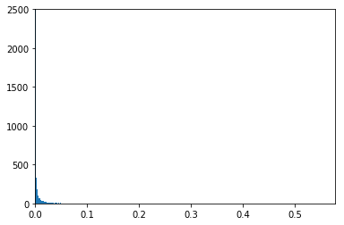


The code cluster diameter distribution resembles a Zipf distribution. Since this is a heavily skewed distribution, I explored [approaches](http://ieeexplore.ieee.org/document/6425713/) that deal with outlier detection using skewness, and computed 99% and 95% cutoffs to pick out physicians with rare code combinations. Subsetting physicians who have a diameter above the extreme cutoff,


```python
df_code_cluster.query('code_cluster_diam != 1 and code_cluster_diam > overall_strong_cut and code_cluster_diam > dept_strong_cut')
```


<div>
<style>
    .dataframe thead tr:only-child th {
        text-align: right;
    }

    .dataframe thead th {
        text-align: left;
    }

    .dataframe tbody tr th {
        vertical-align: top;
    }
</style>
<table border="1" class="dataframe">
  <thead>
    <tr style="text-align: right;">
      <th></th>
      <th>npi</th>
      <th>hcpcs_code</th>
      <th>code_cluster_diam</th>
      <th>department</th>
      <th>dept_mild_cut</th>
      <th>dept_strong_cut</th>
      <th>overall_strong_cut</th>
      <th>overall_mild_cut</th>
    </tr>
  </thead>
  <tbody>
    <tr>
      <th>398</th>
      <td>1760643662</td>
      <td>80500 86077 86078</td>
      <td>0.473242</td>
      <td>Pathology</td>
      <td>0.069307</td>
      <td>0.415842</td>
      <td>0.089109</td>
      <td>0.029703</td>
    </tr>
    <tr>
      <th>1017</th>
      <td>1265404313</td>
      <td>G0283 97110 97001 97140 29200</td>
      <td>0.100000</td>
      <td>Physical Therapist</td>
      <td>-0.009901</td>
      <td>0.029703</td>
      <td>0.089109</td>
      <td>0.029703</td>
    </tr>
    <tr>
      <th>1318</th>
      <td>1417270489</td>
      <td>97110 29581 97001 97140</td>
      <td>0.288675</td>
      <td>Physical Therapist</td>
      <td>-0.009901</td>
      <td>0.029703</td>
      <td>0.089109</td>
      <td>0.029703</td>
    </tr>
    <tr>
      <th>4536</th>
      <td>1063512705</td>
      <td>64445 76942 64416 01996 64447</td>
      <td>0.182031</td>
      <td>Anesthesiology</td>
      <td>0.049505</td>
      <td>0.128713</td>
      <td>0.089109</td>
      <td>0.029703</td>
    </tr>
    <tr>
      <th>4626</th>
      <td>1134295611</td>
      <td>J2001 J3490 01992 01936 J2704</td>
      <td>0.129398</td>
      <td>Anesthesiology</td>
      <td>0.049505</td>
      <td>0.128713</td>
      <td>0.089109</td>
      <td>0.029703</td>
    </tr>
    <tr>
      <th>4649</th>
      <td>1154364826</td>
      <td>01936 93000 01992 99203 99213 80053 00100</td>
      <td>0.150759</td>
      <td>Anesthesiology</td>
      <td>0.049505</td>
      <td>0.128713</td>
      <td>0.089109</td>
      <td>0.029703</td>
    </tr>
    <tr>
      <th>4710</th>
      <td>1194789404</td>
      <td>01924 00541 00790 36620</td>
      <td>0.292410</td>
      <td>Anesthesiology</td>
      <td>0.049505</td>
      <td>0.128713</td>
      <td>0.089109</td>
      <td>0.029703</td>
    </tr>
    <tr>
      <th>4764</th>
      <td>1235143793</td>
      <td>00400 00537</td>
      <td>0.200000</td>
      <td>Anesthesiology</td>
      <td>0.049505</td>
      <td>0.128713</td>
      <td>0.089109</td>
      <td>0.029703</td>
    </tr>
    <tr>
      <th>4866</th>
      <td>1306901525</td>
      <td>64488 99291 36620 00740</td>
      <td>0.250152</td>
      <td>Anesthesiology</td>
      <td>0.049505</td>
      <td>0.128713</td>
      <td>0.089109</td>
      <td>0.029703</td>
    </tr>
    <tr>
      <th>4958</th>
      <td>1376620047</td>
      <td>31500 64415</td>
      <td>0.500000</td>
      <td>Anesthesiology</td>
      <td>0.049505</td>
      <td>0.128713</td>
      <td>0.089109</td>
      <td>0.029703</td>
    </tr>
    <tr>
      <th>5050</th>
      <td>1437398187</td>
      <td>99291 00740 00810 36620 99292</td>
      <td>0.141868</td>
      <td>Anesthesiology</td>
      <td>0.049505</td>
      <td>0.128713</td>
      <td>0.089109</td>
      <td>0.029703</td>
    </tr>
    <tr>
      <th>5200</th>
      <td>1558307603</td>
      <td>43753 36600 99231</td>
      <td>0.388889</td>
      <td>Anesthesiology</td>
      <td>0.049505</td>
      <td>0.128713</td>
      <td>0.089109</td>
      <td>0.029703</td>
    </tr>
    <tr>
      <th>5232</th>
      <td>1588609820</td>
      <td>01992 01830 00142 01936</td>
      <td>0.175953</td>
      <td>Anesthesiology</td>
      <td>0.049505</td>
      <td>0.128713</td>
      <td>0.089109</td>
      <td>0.029703</td>
    </tr>
    <tr>
      <th>5489</th>
      <td>1780764530</td>
      <td>00537 00790</td>
      <td>0.200000</td>
      <td>Anesthesiology</td>
      <td>0.049505</td>
      <td>0.128713</td>
      <td>0.089109</td>
      <td>0.029703</td>
    </tr>
    <tr>
      <th>5527</th>
      <td>1811084254</td>
      <td>01610 00104 00400 00402</td>
      <td>0.222315</td>
      <td>Anesthesiology</td>
      <td>0.049505</td>
      <td>0.128713</td>
      <td>0.089109</td>
      <td>0.029703</td>
    </tr>
    <tr>
      <th>5684</th>
      <td>1932375649</td>
      <td>76937 93503 00142 93313 64488 36620</td>
      <td>0.138051</td>
      <td>Anesthesiology</td>
      <td>0.049505</td>
      <td>0.128713</td>
      <td>0.089109</td>
      <td>0.029703</td>
    </tr>
    <tr>
      <th>11435</th>
      <td>1215041454</td>
      <td>99285 99284 81003 87880</td>
      <td>0.236020</td>
      <td>Physician Assistant</td>
      <td>0.029703</td>
      <td>0.158416</td>
      <td>0.089109</td>
      <td>0.029703</td>
    </tr>
    <tr>
      <th>11603</th>
      <td>1356616288</td>
      <td>99284 36415 99344 99349</td>
      <td>0.235900</td>
      <td>Physician Assistant</td>
      <td>0.029703</td>
      <td>0.158416</td>
      <td>0.089109</td>
      <td>0.029703</td>
    </tr>
    <tr>
      <th>11606</th>
      <td>1356693006</td>
      <td>29826 29821</td>
      <td>0.333333</td>
      <td>Physician Assistant</td>
      <td>0.029703</td>
      <td>0.158416</td>
      <td>0.089109</td>
      <td>0.029703</td>
    </tr>
    <tr>
      <th>11737</th>
      <td>1457681553</td>
      <td>27447 99238</td>
      <td>0.250000</td>
      <td>Physician Assistant</td>
      <td>0.029703</td>
      <td>0.158416</td>
      <td>0.089109</td>
      <td>0.029703</td>
    </tr>
    <tr>
      <th>11836</th>
      <td>1538404454</td>
      <td>15734 38747</td>
      <td>0.250000</td>
      <td>Physician Assistant</td>
      <td>0.029703</td>
      <td>0.158416</td>
      <td>0.089109</td>
      <td>0.029703</td>
    </tr>
    <tr>
      <th>11964</th>
      <td>1649522574</td>
      <td>29827 29826 29823 29822 29828 29825</td>
      <td>0.161078</td>
      <td>Physician Assistant</td>
      <td>0.029703</td>
      <td>0.158416</td>
      <td>0.089109</td>
      <td>0.029703</td>
    </tr>
    <tr>
      <th>11970</th>
      <td>1649689555</td>
      <td>99222 60500 47562 60240 99232</td>
      <td>0.211481</td>
      <td>Physician Assistant</td>
      <td>0.029703</td>
      <td>0.158416</td>
      <td>0.089109</td>
      <td>0.029703</td>
    </tr>
    <tr>
      <th>11981</th>
      <td>1659639599</td>
      <td>69990 63047 99284</td>
      <td>0.474667</td>
      <td>Physician Assistant</td>
      <td>0.029703</td>
      <td>0.158416</td>
      <td>0.089109</td>
      <td>0.029703</td>
    </tr>
    <tr>
      <th>12087</th>
      <td>1750612297</td>
      <td>48153 15734 38747</td>
      <td>0.250000</td>
      <td>Physician Assistant</td>
      <td>0.029703</td>
      <td>0.158416</td>
      <td>0.089109</td>
      <td>0.029703</td>
    </tr>
    <tr>
      <th>12210</th>
      <td>1851701601</td>
      <td>99214 46600 46606</td>
      <td>0.372807</td>
      <td>Physician Assistant</td>
      <td>0.029703</td>
      <td>0.158416</td>
      <td>0.089109</td>
      <td>0.029703</td>
    </tr>
    <tr>
      <th>12239</th>
      <td>1881019925</td>
      <td>63005 22845 22851 22612 63056 63011 63017 63057</td>
      <td>0.165760</td>
      <td>Physician Assistant</td>
      <td>0.029703</td>
      <td>0.158416</td>
      <td>0.089109</td>
      <td>0.029703</td>
    </tr>
    <tr>
      <th>12263</th>
      <td>1891942173</td>
      <td>15734 38747</td>
      <td>0.250000</td>
      <td>Physician Assistant</td>
      <td>0.029703</td>
      <td>0.158416</td>
      <td>0.089109</td>
      <td>0.029703</td>
    </tr>
    <tr>
      <th>12726</th>
      <td>1124395199</td>
      <td>91200 99214 99212 99213</td>
      <td>0.288675</td>
      <td>Nurse Practitioner</td>
      <td>0.009901</td>
      <td>0.059406</td>
      <td>0.089109</td>
      <td>0.029703</td>
    </tr>
    <tr>
      <th>12743</th>
      <td>1134403637</td>
      <td>99222 99283 99285 47563 99284 99231</td>
      <td>0.115578</td>
      <td>Nurse Practitioner</td>
      <td>0.009901</td>
      <td>0.059406</td>
      <td>0.089109</td>
      <td>0.029703</td>
    </tr>
    <tr>
      <th>...</th>
      <td>...</td>
      <td>...</td>
      <td>...</td>
      <td>...</td>
      <td>...</td>
      <td>...</td>
      <td>...</td>
      <td>...</td>
    </tr>
    <tr>
      <th>14526</th>
      <td>1932116159</td>
      <td>87210 G0101 99213 87088</td>
      <td>0.186899</td>
      <td>Nurse Practitioner</td>
      <td>0.009901</td>
      <td>0.059406</td>
      <td>0.089109</td>
      <td>0.029703</td>
    </tr>
    <tr>
      <th>14646</th>
      <td>1972884062</td>
      <td>99213 16020 99201</td>
      <td>0.372682</td>
      <td>Nurse Practitioner</td>
      <td>0.009901</td>
      <td>0.059406</td>
      <td>0.089109</td>
      <td>0.029703</td>
    </tr>
    <tr>
      <th>14653</th>
      <td>1982002812</td>
      <td>99349 51798 51701 99213 81003</td>
      <td>0.142426</td>
      <td>Nurse Practitioner</td>
      <td>0.009901</td>
      <td>0.059406</td>
      <td>0.089109</td>
      <td>0.029703</td>
    </tr>
    <tr>
      <th>19747</th>
      <td>1649254095</td>
      <td>76811 76816 76817</td>
      <td>0.577350</td>
      <td>Obstetrics/Gynecology</td>
      <td>0.059406</td>
      <td>0.138614</td>
      <td>0.089109</td>
      <td>0.029703</td>
    </tr>
    <tr>
      <th>19912</th>
      <td>1790873016</td>
      <td>57282 99214 76830 99204 99213</td>
      <td>0.158147</td>
      <td>Obstetrics/Gynecology</td>
      <td>0.059406</td>
      <td>0.138614</td>
      <td>0.089109</td>
      <td>0.029703</td>
    </tr>
    <tr>
      <th>19964</th>
      <td>1861425050</td>
      <td>99213 99204 99212 99214 57410</td>
      <td>0.200000</td>
      <td>Obstetrics/Gynecology</td>
      <td>0.059406</td>
      <td>0.138614</td>
      <td>0.089109</td>
      <td>0.029703</td>
    </tr>
    <tr>
      <th>22153</th>
      <td>1336116151</td>
      <td>38206 99215 99205 99214</td>
      <td>0.184257</td>
      <td>Hematology/Oncology</td>
      <td>0.039604</td>
      <td>0.099010</td>
      <td>0.089109</td>
      <td>0.029703</td>
    </tr>
    <tr>
      <th>22182</th>
      <td>1396731063</td>
      <td>99234 85240 99214 85730 85025 85335 99203 3641...</td>
      <td>0.111624</td>
      <td>Hematology/Oncology</td>
      <td>0.039604</td>
      <td>0.099010</td>
      <td>0.089109</td>
      <td>0.029703</td>
    </tr>
    <tr>
      <th>25100</th>
      <td>1881602043</td>
      <td>96118 96150 96154</td>
      <td>0.473242</td>
      <td>Clinical Psychologist</td>
      <td>0.148515</td>
      <td>0.415842</td>
      <td>0.089109</td>
      <td>0.029703</td>
    </tr>
    <tr>
      <th>25275</th>
      <td>1114264801</td>
      <td>00567 00534 01844</td>
      <td>0.472582</td>
      <td>CRNA</td>
      <td>0.118812</td>
      <td>0.415842</td>
      <td>0.089109</td>
      <td>0.029703</td>
    </tr>
    <tr>
      <th>25553</th>
      <td>1376639062</td>
      <td>36410 01810 00790</td>
      <td>0.471430</td>
      <td>CRNA</td>
      <td>0.118812</td>
      <td>0.415842</td>
      <td>0.089109</td>
      <td>0.029703</td>
    </tr>
    <tr>
      <th>26382</th>
      <td>1003874421</td>
      <td>99214 92326</td>
      <td>0.250000</td>
      <td>Optometry</td>
      <td>0.009901</td>
      <td>0.069307</td>
      <td>0.089109</td>
      <td>0.029703</td>
    </tr>
    <tr>
      <th>26413</th>
      <td>1023080553</td>
      <td>99347 99203 99348 99343 99214 92014 92012 9200...</td>
      <td>0.096281</td>
      <td>Optometry</td>
      <td>0.009901</td>
      <td>0.069307</td>
      <td>0.089109</td>
      <td>0.029703</td>
    </tr>
    <tr>
      <th>26447</th>
      <td>1053477083</td>
      <td>92065 97112 99212 99204 99213 92012</td>
      <td>0.163307</td>
      <td>Optometry</td>
      <td>0.009901</td>
      <td>0.069307</td>
      <td>0.089109</td>
      <td>0.029703</td>
    </tr>
    <tr>
      <th>26457</th>
      <td>1063569317</td>
      <td>99214 99204 99213 92134 99343</td>
      <td>0.100834</td>
      <td>Optometry</td>
      <td>0.009901</td>
      <td>0.069307</td>
      <td>0.089109</td>
      <td>0.029703</td>
    </tr>
    <tr>
      <th>26717</th>
      <td>1316098148</td>
      <td>92014 92283 92250</td>
      <td>0.138890</td>
      <td>Optometry</td>
      <td>0.009901</td>
      <td>0.069307</td>
      <td>0.089109</td>
      <td>0.029703</td>
    </tr>
    <tr>
      <th>27014</th>
      <td>1609878040</td>
      <td>97530 92014 99213</td>
      <td>0.333351</td>
      <td>Optometry</td>
      <td>0.009901</td>
      <td>0.069307</td>
      <td>0.089109</td>
      <td>0.029703</td>
    </tr>
    <tr>
      <th>27095</th>
      <td>1699778456</td>
      <td>92014 92004 92225 92285 68040 92226 92100 92012</td>
      <td>0.098534</td>
      <td>Optometry</td>
      <td>0.009901</td>
      <td>0.069307</td>
      <td>0.089109</td>
      <td>0.029703</td>
    </tr>
    <tr>
      <th>27108</th>
      <td>1700842341</td>
      <td>92326 99213 92250 99214</td>
      <td>0.125001</td>
      <td>Optometry</td>
      <td>0.009901</td>
      <td>0.069307</td>
      <td>0.089109</td>
      <td>0.029703</td>
    </tr>
    <tr>
      <th>27351</th>
      <td>1912913047</td>
      <td>99214 99213 99204 92326 92250</td>
      <td>0.125001</td>
      <td>Optometry</td>
      <td>0.009901</td>
      <td>0.069307</td>
      <td>0.089109</td>
      <td>0.029703</td>
    </tr>
    <tr>
      <th>28634</th>
      <td>1134193220</td>
      <td>99203 99213 43770</td>
      <td>0.235702</td>
      <td>General Surgery</td>
      <td>0.069307</td>
      <td>0.198020</td>
      <td>0.089109</td>
      <td>0.029703</td>
    </tr>
    <tr>
      <th>28668</th>
      <td>1184608879</td>
      <td>99215 99223 15931</td>
      <td>0.471405</td>
      <td>General Surgery</td>
      <td>0.069307</td>
      <td>0.198020</td>
      <td>0.089109</td>
      <td>0.029703</td>
    </tr>
    <tr>
      <th>28768</th>
      <td>1336193283</td>
      <td>99203 43499 99212</td>
      <td>0.471405</td>
      <td>General Surgery</td>
      <td>0.069307</td>
      <td>0.198020</td>
      <td>0.089109</td>
      <td>0.029703</td>
    </tr>
    <tr>
      <th>28785</th>
      <td>1366602666</td>
      <td>76536 99213 99203 60500 78800</td>
      <td>0.207100</td>
      <td>General Surgery</td>
      <td>0.069307</td>
      <td>0.198020</td>
      <td>0.089109</td>
      <td>0.029703</td>
    </tr>
    <tr>
      <th>28922</th>
      <td>1568435428</td>
      <td>99202 99212 60500 60240 99211</td>
      <td>0.211477</td>
      <td>General Surgery</td>
      <td>0.069307</td>
      <td>0.198020</td>
      <td>0.089109</td>
      <td>0.029703</td>
    </tr>
    <tr>
      <th>29137</th>
      <td>1902894413</td>
      <td>17108 36556 99212 99222</td>
      <td>0.288694</td>
      <td>General Surgery</td>
      <td>0.069307</td>
      <td>0.198020</td>
      <td>0.089109</td>
      <td>0.029703</td>
    </tr>
    <tr>
      <th>29194</th>
      <td>1992779086</td>
      <td>99204 60500 60512 60271 99214 99213</td>
      <td>0.200564</td>
      <td>General Surgery</td>
      <td>0.069307</td>
      <td>0.198020</td>
      <td>0.089109</td>
      <td>0.029703</td>
    </tr>
    <tr>
      <th>30294</th>
      <td>1518948181</td>
      <td>99213 27380 27447</td>
      <td>0.235704</td>
      <td>Orthopedic Surgery</td>
      <td>0.118812</td>
      <td>0.227723</td>
      <td>0.089109</td>
      <td>0.029703</td>
    </tr>
    <tr>
      <th>30754</th>
      <td>1245517317</td>
      <td>99354 90834 90837</td>
      <td>0.471410</td>
      <td>Licensed Clinical Social Worker</td>
      <td>0.009901</td>
      <td>0.059406</td>
      <td>0.089109</td>
      <td>0.029703</td>
    </tr>
    <tr>
      <th>31003</th>
      <td>1841542917</td>
      <td>90832 90785 90791 90853</td>
      <td>0.169438</td>
      <td>Licensed Clinical Social Worker</td>
      <td>0.009901</td>
      <td>0.059406</td>
      <td>0.089109</td>
      <td>0.029703</td>
    </tr>
  </tbody>
</table>
<p>71 rows × 8 columns</p>
</div>


Exploring further on the list above,


```python
df_raw_claims[df_raw_claims['National Provider Identifier'] == 1437398187][['Provider Type', 'HCPCS Description']].to_csv(sys.stdout)
```

    ,Provider Type,HCPCS Description
    46630,Anesthesiology,"Critical care delivery critically ill or injured patient, first 30-74 minutes"
    2564509,Anesthesiology,Anesthesia for procedure on gastrointestinal tract using an endoscope
    4557492,Anesthesiology,Anesthesia for procedure on lower intestine using an endoscope
    4883632,Anesthesiology,"Insertion of arterial catheter for blood sampling or infusion, accessed through the skin"
    6506873,Anesthesiology,Critical care delivery critically ill or injured patient


While the physician is an anesthesiologist, the services delivered by them seem to have some overlap with Emergency Medicine. 


```python
df_raw_claims[df_raw_claims['National Provider Identifier'] ==1366602666][['Provider Type', 'HCPCS Description']].to_csv(sys.stdout)
```

    ,Provider Type,HCPCS Description
    1293578,General Surgery,Ultrasound of head and neck
    1559934,General Surgery,"Established patient office or other outpatient visit, typically 15 minutes"
    3364851,General Surgery,"New patient office or other outpatient visit, typically 30 minutes"
    5167923,General Surgery,Removal or exploration of parathyroid glands
    6899632,General Surgery,"Established patient office or other outpatient visit, typically 15 minutes"
    7205008,General Surgery,Nuclear medicine study of radioactive material distribution at tumor location


This general surgeon seems to also offer Nuclear Medicine services.


```python
df_raw_claims[df_raw_claims['National Provider Identifier'] == 1154364826][['Provider Type', 'HCPCS Description']].to_csv(sys.stdout)
```

    ,Provider Type,HCPCS Description
    148063,Anesthesiology,Anesthesia for X-ray procedure (accessed through the skin) on spine and spinal cord
    2892629,Anesthesiology,Routine EKG using at least 12 leads including interpretation and report
    3702662,Anesthesiology,"Anesthesia for nerve block and injection procedure, prone position"
    4355175,Anesthesiology,"New patient office or other outpatient visit, typically 30 minutes"
    4369186,Anesthesiology,"Anesthesia for nerve block and injection procedure, prone position"
    6313282,Anesthesiology,"Established patient office or other outpatient visit, typically 15 minutes"
    8488958,Anesthesiology,"Blood test, comprehensive group of blood chemicals"
    8689844,Anesthesiology,Anesthesia for procedure on salivary gland with biopsy


EKG and Blood tests seem to be less common in Anesthesiology and more in Pathology/ Hematology departments. While the outliers detected by this approach might not be fraudulent, as there can be other factors such as physicians with multiple specialties, it could be that the service combinations are very not common, and hence is a valid starting point to investigate. A modification to this technique, using price similarity instead of text similarity, could be used to detect inflated bills.

# Supervised Learning approaches to predict overcharge ratio
# Data Preparation

Since I found relationships between online reviews and overcharge ratios, I stacked the claims dataset with other datasets in public domain such as patient reviews and physician quality metrics, widened them, and ended up with 125 features. Some of them, such as facility_type, department and hcpcs_code, are factor variables. I binary encoded features with 2 levels and one-hot encoded the rest, using scikit-learn pipelines, and ended up with 198 features. Later during my analysis, I found that the variable, 'avg_medicare_allowed_amount' to be highly correlated with the target variable. It wasn't clear if this variable is just an average of all adjustments for the corresponding service, or a historical threshold value. To get reasonal estimates, and to prevent this feature from giving too optimistic predictions, I decided to go ahead with the remaining 197 features. 


```python
def add_tag_to_score_colnames(id_col, df, scoretag):
    cols = [id_col]
    for col in df.columns:
        if col != id_col:
            cols.append(scoretag + '_' + col)
    df.columns = cols

def pythonize_colnames(df):
    df.columns = list(map(lambda each:re.sub('[^0-9a-zA-Z]+', '_', each).lower(), df.columns))

def get_physician_info(filename):
    df_physician_info = pd.read_csv(os.path.join(DATA_FOLDER, filename))
    df_physician_info = df_physician_info.loc[df_physician_info['State'] == 'IL']
    pythonize_colnames(df_physician_info)
    return df_physician_info

def get_performance_scores(filename):
    df_performance_scores = pd.read_csv(os.path.join(DATA_FOLDER, filename))
    df_performance_scores = df_performance_scores[['NPI', 'Measure Identifier', 'Measure Performance Rate']]
    df_performance_scores.columns = ['npi', 'measure', 'score']
    df_performance_scores = df_performance_scores.pivot(index='npi', columns='measure', values='score').reset_index()

    add_tag_to_score_colnames('npi', df_performance_scores, 'perfrm')

    return df_performance_scores

def get_patient_scores(filename):
    df_patient_scores = pd.read_csv(os.path.join(DATA_FOLDER, filename))
    df_patient_scores = df_patient_scores[['Group PAC ID', 'Measure Identifier',
                                           'Measure Performance Rate']]
    df_patient_scores.columns = ['group_practice_pac_id', 'measure', 'score']
    df_patient_scores = df_patient_scores.pivot(index='group_practice_pac_id', columns='measure',
                                                values='score').reset_index()

    add_tag_to_score_colnames('group_practice_pac_id', df_patient_scores, 'patnt')
    return df_patient_scores

def get_claims(filename):
    df_claims = pd.read_csv(os.path.join(DATA_FOLDER, filename))
    df_claims = df_claims[
        ['National Provider Identifier', 'Gender of the Provider', 'Provider Type', 'Medicare Participation Indicator',
         'Place of Service', 'HCPCS Code', 'HCPCS Drug Indicator', 'Number of Services',
         'Number of Medicare Beneficiaries', 'Number of Distinct Medicare Beneficiary/Per Day Services', 'Average Submitted Charge Amount', 'Average Medicare Payment Amount']]
    df_claims.columns = ['npi', 'sex', 'department', 'is_participant', 'facility_type', 'hcpcs_code', 'includes_drug',
                         'no_service', 'no_medicare_benef', 'no_distinct_medicare_benef_per_day', 'avg_submitted_charge_amt', 'avg_medicare_payment_amt']

    df_claims['overcharge_ratio'] = 1 - df_claims['avg_medicare_payment_amt'] / df_claims['avg_submitted_charge_amt']

    return df_claims


def get_data(phy_filename, perf_filename, patnt_filename, claims_filename):
    df_physician_info = get_physician_info(phy_filename)

    df_patient_scores = get_patient_scores(patnt_filename)

    df_performance_scores = get_performance_scores(perf_filename)

    df_claims = get_claims(claims_filename)

    df_performance_scores = df_performance_scores[
        df_performance_scores['npi'].isin(list(df_physician_info.npi.unique()))]

    df_patient_scores = df_patient_scores[
        df_patient_scores['group_practice_pac_id'].isin(list(df_physician_info['group_practice_pac_id'].unique()))]

    df_physician_info = pd.merge(pd.merge(df_physician_info, df_performance_scores, on='npi', how='left'),
                                 df_patient_scores, on='group_practice_pac_id', how='left')

    df_claims = df_claims[df_claims['npi'].isin(list(df_physician_info['npi'].unique()))]

    df_claims = pd.merge(df_claims, df_physician_info, on='npi', how='left')

    df_claims = df_claims.apply(pd.to_numeric, errors='ignore')

    pythonize_colnames(df_claims)

    df_claims.drop(
        ['pac_id', 'professional_enrollment_id', 'last_name', 'first_name', 'middle_name', 'suffix', 'gender',
         'credential', 'medical_school_name', 'primary_specialty', 'secondary_specialty_1', 'secondary_specialty_2',
         'secondary_specialty_3', 'secondary_specialty_4', 'all_secondary_specialties', 'organization_legal_name',
         'group_practice_pac_id', 'line_1_street_address', 'line_2_street_address',
         'marker_of_address_line_2_suppression', 'city', 'state', 'zip_code', 'phone_number',
         'hospital_affiliation_ccn_1', 'hospital_affiliation_lbn_1', 'hospital_affiliation_ccn_2',
         'hospital_affiliation_lbn_2', 'hospital_affiliation_ccn_3', 'hospital_affiliation_lbn_3',
         'hospital_affiliation_ccn_4', 'hospital_affiliation_lbn_4', 'hospital_affiliation_ccn_5',
         'hospital_affiliation_lbn_5', ], axis=1, inplace=True)

    df_claims = df_claims.dropna(axis=1, how='all')


    return df_claims

def get_encoders(model='other'):
    transformers = [(col, ce.BinaryEncoder(cols=[col])) for col in ['sex',
                                                                    'includes_drug',
                                                                    'facility_type',
                                                                    'is_participant',
                                                                    'professional_accepts_medicare_assignment',
                                                                    'reported_quality_measures',
                                                                    'committed_to_heart_health_through_the_million_hearts_initiative_',
                                                                    'used_electronic_health_records'
                                                                    ]]

    if model == 'cluster':
        return transformers
    elif model == 'tree':
        return (transformers + [('department', ce.OneHotEncoder(cols=['department'])),
                                ('hcpcs_code', ce.OneHotEncoder(cols=['hcpcs_code']))])
    else:
        return (transformers + [('department', ce.OneHotEncoder(cols=['department'])),
                                ('hcpcs_code', ce.OneHotEncoder(cols=['hcpcs_code'])),
                                ('scaler', RobustScaler(with_centering=False))])
```

# Linear Regression

I used recursive feature elimination (RFECV) to rank features and use cross validation to select the best set of features. Since the features are of disparate units, I used a RobustScaler as I found that this is better suited for a sparse feature matrix.


```python
def replace_nans(df):

    df_numerical = df.select_dtypes(exclude=['object'])
    df_numerical.fillna(-1, inplace=True)

    df_categoric = df.select_dtypes(include=['object'])
    df_categoric.fillna('NONE', inplace=True)

    df = df_numerical.merge(df_categoric, left_index=True, right_index=True)

    return df

def get_train_test(df, test_size=0.33, seed=42):
    X = df.drop(['npi', 'avg_medicare_payment_amt', 'overcharge_ratio'], axis=1, inplace=False)
    Y = df['overcharge_ratio']
    X_Train, X_Test, Y_Train, Y_Test = train_test_split(X, Y, test_size=test_size, random_state=seed)

    return (X_Train, X_Test, Y_Train, Y_Test)

def get_lreg_model(df_claims, test_size, seed):

    df_claims = replace_nans(df_claims)
    X_Train, X_Test, Y_Train, Y_Test = get_train_test(df_claims, test_size, seed)

    encoders = get_encoders()

    # Using separate pipelines for transformer and estimator due to RFECV's bug #6321

    transformer_pipe = Pipeline(encoders )

    linear_model = RFECV(estimator=LinearRegression(n_jobs=-1, scoring='neg_mean_squared_error'), step=1, cv=5)

    transformer_pipe.fit(X_Train)

    X_Train_transformed = transformer_pipe.transform(X_Train)
    X_Test_transformed = transformer_pipe.transform(X_Test)

    linear_model.fit(X_Train_transformed, Y_Train)

    linear_preds = linear_model.predict(X_Test_transformed)


    result = {'lreg_model': linear_model,
              'lreg_preds': linear_preds,
              'transformer': transformer_pipe,
              'features': get_transformed_column_names(X_Train)
              }

    return result

X_Train, X_Test, Y_Train, Y_Test = get_train_test(df_claims)
```


```python
with open(os.path.join(DATA_FOLDER, 'lreg.pickle'), 'rb') as handle:
    lreg = pickle.load(handle)
```


```python
lreg['lreg_model'].n_features_
```


    74


```python
# Plot number of features VS. cross-validation scores
plt.figure()
plt.xlabel("Number of features selected")
plt.ylabel("Cross validation score (nb of correct classifications)")
plt.plot(range(1, len(lreg['lreg_model'].grid_scores_) + 1), lreg['lreg_model'].grid_scores_)
plt.show()
```


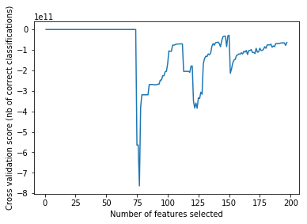


```python
dct_model_comparison = [{'model' : 'Linear Regression',
                        'mse': mean_squared_error(Y_Test, lreg['lreg_preds']),
                        'r2_score': r2_score(Y_Test, lreg['lreg_preds'])}]
r2_score(Y_Test, lreg['lreg_preds'])
```


    0.25144046129725883


Important observation is that the target values might not always be restricted to the range [0,1]. Rates need to be modeled using a beta regression model. I adopt a logit regression approach, transforming the target values using the logit function.


```python
import numpy as np
from sklearn.linear_model import LinearRegression
module_path = os.path.abspath(os.path.join('..'))
if module_path not in sys.path:
    sys.path.append(module_path)
    
import medicare_analysis.logit_regression as logit_regression

class LogitRegression(LinearRegression):

    def fit(self, x, p):
        p = np.asarray(p)
        p[p ==1] = 0.999
        p[p == 0] = 0.001
        y = np.log(p / (1.0 - p))
        return super().fit(x, y)

    def predict(self, x):
        y = super().predict(x)
        return 1 / (np.exp(-y) + 1)
    
def get_breg_model(df_claims, test_size, seed):

    df_claims = replace_nans(df_claims)
    X_Train, X_Test, Y_Train, Y_Test = get_train_test(df_claims, test_size, seed)

    encoders = get_encoders()

    # Using separate pipelines for transformer and estimator due to RFECV's bug #6321

    transformer_pipe = Pipeline(encoders )

    linear_model = RFECV(estimator=LogitRegression(), scoring = 'neg_mean_squared_error', step=1, cv=5)

    transformer_pipe.fit(X_Train)

    X_Train_transformed = transformer_pipe.transform(X_Train)
    X_Test_transformed = transformer_pipe.transform(X_Test)

    linear_model.fit(X_Train_transformed, Y_Train)

    linear_preds = linear_model.predict(X_Test_transformed)


    result = {'lreg_model': linear_model,
              'lreg_preds': linear_preds,
              'transformer': transformer_pipe,
              'features': get_transformed_column_names(X_Train)
              }

    return result

with open(os.path.join(DATA_FOLDER, 'breg_preds.pickle'), 'rb') as handle:
    breg = pickle.load(handle)
```

    /Users/manu/anaconda3/envs/gdal2/lib/python3.6/site-packages/sklearn/cross_validation.py:41: DeprecationWarning: This module was deprecated in version 0.18 in favor of the model_selection module into which all the refactored classes and functions are moved. Also note that the interface of the new CV iterators are different from that of this module. This module will be removed in 0.20.
      "This module will be removed in 0.20.", DeprecationWarning)


```python
dct_model_comparison.append({'model' : 'Logit Regression',
                             'mse': mean_squared_error(Y_Test, breg['breg_preds']),
                             'r2_score': r2_score(Y_Test, breg['breg_preds'])})

r2_score(Y_Test, breg['breg_preds'])
```


    0.30666072204224992


```python
plt.xlabel("avg_submitted_charge_amt")
plt.ylabel("predicted or actual")
plt.scatter(X_Test['avg_submitted_charge_amt'], Y_Test, s=10, c='b', marker="s")
plt.scatter(X_Test['avg_submitted_charge_amt'], breg['breg_preds'],color='black')

plt.show()
plt.figure()
```


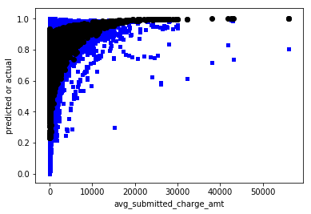


    <matplotlib.figure.Figure at 0x172fc82b0>


    <matplotlib.figure.Figure at 0x172fc82b0>


The fit seems to have improved, but still it can be improved with non-linear models. 

# Random Forest Regression

Gridsearch is used to tune forest density, tree heights, max features and number of samples in leaf nodes. Since tree based models are not affected by disparate feature scales, tree pipelines don't have the scaling step.


```python
from xgboost import plot_importance
def get_rforest_model(df_claims, test_size, seed):
    df_claims = replace_nans(df_claims)
    X_Train, X_Test, Y_Train, Y_Test = get_train_test(df_claims, test_size, seed)

    encoders = get_encoders('tree')

    forest_params = {'rforest__max_features': [0.5, 0.7],
                     'rforest__min_samples_leaf': [200, 300],
                     'rforest__max_depth': [ 6, 10, None]
                     }

    rforest_estimator = [('rforest', RandomForestRegressor(random_state=seed, oob_score=True))]

    rforest_pipe = Pipeline(encoders + rforest_estimator)

    rforest = GridSearchCV(estimator=rforest_pipe,
                           param_grid=forest_params,
                           scoring='neg_mean_squared_error',
                           n_jobs=-1,
                           iid=False,
                           refit=True,
                           cv=5)


    rforest.fit(X_Train, Y_Train)

    rforest_preds = rforest.predict(X_Test)

    result = {'rforest_model': rforest,
              'rforest_preds': rforest_preds,
              'features': get_transformed_column_names(X_Train)
              }

    return result


with open(os.path.join(DATA_FOLDER, 'rforest_mdepth.pickle'), 'rb') as handle:
    rforest_pickle = pickle.load(handle)
```

    /Users/manu/anaconda3/envs/gdal2/lib/python3.6/site-packages/sklearn/grid_search.py:42: DeprecationWarning: This module was deprecated in version 0.18 in favor of the model_selection module into which all the refactored classes and functions are moved. This module will be removed in 0.20.
      DeprecationWarning)


```python
rforest_pickle['rforest_model'].best_params_
```


    {'rforest__max_depth': None,
     'rforest__max_features': 0.7,
     'rforest__min_samples_leaf': 200}


```python
r2_score(Y_Test, rforest_pickle['rforest_preds'])
```


    0.54252467396106863


```python
indices = np.argsort(rforest_pickle['rforest_model'].best_estimator_.named_steps['rforest'].feature_importances_)[::-1]
plot_importance(dict(list(pd.DataFrame({'features': rforest_pickle['features'][indices],
              'importance': rforest_pickle['rforest_model'].best_estimator_.named_steps['rforest'].feature_importances_[indices]}).iloc[:10,].apply(lambda x: (x.features, int(x.importance*100000)), axis=1))), height = 0.8)
plt.show()
```


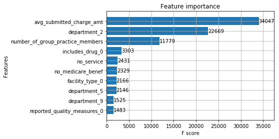


Claim amount, size of the organisation (no of group practice members) and number of services provided are some of the features of high importance. This aligns with the relationship we observed earlier between claim amounts and overcharge ratio. Departments also showed high inter-group variation in adjustment amounts, and their featuring in the plot looks plausible.


```python
dct_model_comparison.append({'model' : 'RForest',
                             'mse': mean_squared_error(Y_Test, rforest_pickle['rforest_preds']),
                             'r2_score': r2_score(Y_Test, rforest_pickle['rforest_preds'])})

r2_score(Y_Test, rforest_pickle['rforest_preds'])
```


    0.54252467396106863


There is a great improvement in fit compared to linear regression.


```python
plt.xlabel("avg_submitted_charge_amt")
plt.ylabel("predicted or actual")
plt.scatter(X_Test['avg_submitted_charge_amt'], Y_Test, s=10, c='b', marker="s")
plt.scatter(X_Test['avg_submitted_charge_amt'], rforest_pickle['rforest_preds'],color='black')

plt.show()
plt.figure()
```


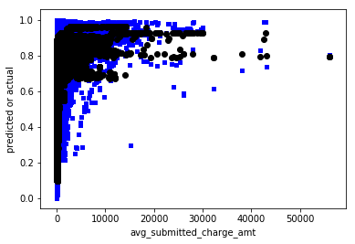


    <matplotlib.figure.Figure at 0x173146978>


    <matplotlib.figure.Figure at 0x173146978>


# Extreme Gradient Boosted Regression

Gridsearch is used to tree heights, gamma value that decides how conservative tree partitions are,  max features and number of samples in leaf nodes, ratio of instances and features used to build trees and learning rate.


```python
from xgboost import plot_importance
def get_xgboost_model(df_claims, test_size, seed):

    df_claims = replace_nans(df_claims)
    X_Train, X_Test, Y_Train, Y_Test = get_train_test(df_claims, test_size, seed)

    encoders = get_encoders('tree')


    boost_params = {'xgboost__max_depth': [8, 10],
                    'xgboost__gamma': [0.15, 2],
                    'xgboost__subsample': [0.6],
                    'xgboost__colsample_bytree': [ 0.6],
                    'xgboost__learning_rate': [0.2, 0.0]
                    }

    xgboost_estimator = [('xgboost', XGBRegressor(missing=-1))]
    xgboost_pipe = Pipeline(encoders + xgboost_estimator)

    xgboost_model = GridSearchCV(estimator=xgboost_pipe,
                                 param_grid=boost_params,
                                 scoring='neg_mean_squared_error',
                                 iid=False,
                                 refit=True,
                                 cv=5)


    xgboost_model.fit(X_Train, Y_Train)

    xgboost_preds = xgboost_model.predict(X_Test)

    result = {'xgboost_model': xgboost_model,
              'xgboost_preds': xgboost_preds,
              'features': get_transformed_column_names(X_Train)
              }

    return result

with open(os.path.join(DATA_FOLDER, 'xgboost_reduced.pickle'), 'rb') as handle:
    xgboost_pickle = pickle.load(handle)
```


```python
plot_importance(dict(sorted(xgboost_pickle['xgboost_model'].best_estimator_.named_steps['xgboost'].booster().get_fscore().items(), reverse = True, key=lambda x:x[1])[:10]), height = 0.8)
plt.show()
```


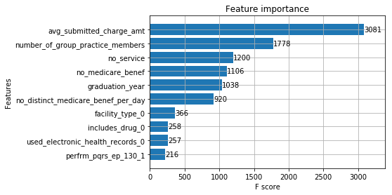


Graduation year (proxy for experience), claim amount, size of the organisation (no of group practice members) and number of services provided are some of the features of high importance. This aligns with the relationship we observed earlier between claim amounts and overcharge ratio. It can also be the case that physicians with less number of years since graduation face high claim rejections. 


```python
xgboost_pickle['xgboost_model'].best_params_
```


    {'xgboost__colsample_bytree': 0.6,
     'xgboost__gamma': 0.15,
     'xgboost__learning_rate': 0.2,
     'xgboost__max_depth': 10,
     'xgboost__min_child_weight': 0.05,
     'xgboost__subsample': 0.6}


```python
xgboost_pickle['xgboost_model'].grid_scores_
```


    [mean: -0.01386, std: 0.00017, params: {'xgboost__colsample_bytree': 0.6, 'xgboost__gamma': 0.15, 'xgboost__learning_rate': 0.2, 'xgboost__max_depth': 8, 'xgboost__min_child_weight': 0.05, 'xgboost__subsample': 0.6},
     mean: -0.01386, std: 0.00017, params: {'xgboost__colsample_bytree': 0.6, 'xgboost__gamma': 0.15, 'xgboost__learning_rate': 0.2, 'xgboost__max_depth': 8, 'xgboost__min_child_weight': 0.1, 'xgboost__subsample': 0.6},
     mean: -0.01228, std: 0.00014, params: {'xgboost__colsample_bytree': 0.6, 'xgboost__gamma': 0.15, 'xgboost__learning_rate': 0.2, 'xgboost__max_depth': 10, 'xgboost__min_child_weight': 0.05, 'xgboost__subsample': 0.6},
     mean: -0.01228, std: 0.00014, params: {'xgboost__colsample_bytree': 0.6, 'xgboost__gamma': 0.15, 'xgboost__learning_rate': 0.2, 'xgboost__max_depth': 10, 'xgboost__min_child_weight': 0.1, 'xgboost__subsample': 0.6},
     mean: -0.07159, std: 0.00009, params: {'xgboost__colsample_bytree': 0.6, 'xgboost__gamma': 0.15, 'xgboost__learning_rate': 0.0, 'xgboost__max_depth': 8, 'xgboost__min_child_weight': 0.05, 'xgboost__subsample': 0.6},
     mean: -0.07159, std: 0.00009, params: {'xgboost__colsample_bytree': 0.6, 'xgboost__gamma': 0.15, 'xgboost__learning_rate': 0.0, 'xgboost__max_depth': 8, 'xgboost__min_child_weight': 0.1, 'xgboost__subsample': 0.6},
     mean: -0.07159, std: 0.00009, params: {'xgboost__colsample_bytree': 0.6, 'xgboost__gamma': 0.15, 'xgboost__learning_rate': 0.0, 'xgboost__max_depth': 10, 'xgboost__min_child_weight': 0.05, 'xgboost__subsample': 0.6},
     mean: -0.07159, std: 0.00009, params: {'xgboost__colsample_bytree': 0.6, 'xgboost__gamma': 0.15, 'xgboost__learning_rate': 0.0, 'xgboost__max_depth': 10, 'xgboost__min_child_weight': 0.1, 'xgboost__subsample': 0.6},
     mean: -0.01685, std: 0.00021, params: {'xgboost__colsample_bytree': 0.6, 'xgboost__gamma': 2, 'xgboost__learning_rate': 0.2, 'xgboost__max_depth': 8, 'xgboost__min_child_weight': 0.05, 'xgboost__subsample': 0.6},
     mean: -0.01685, std: 0.00021, params: {'xgboost__colsample_bytree': 0.6, 'xgboost__gamma': 2, 'xgboost__learning_rate': 0.2, 'xgboost__max_depth': 8, 'xgboost__min_child_weight': 0.1, 'xgboost__subsample': 0.6},
     mean: -0.01623, std: 0.00013, params: {'xgboost__colsample_bytree': 0.6, 'xgboost__gamma': 2, 'xgboost__learning_rate': 0.2, 'xgboost__max_depth': 10, 'xgboost__min_child_weight': 0.05, 'xgboost__subsample': 0.6},
     mean: -0.01623, std: 0.00013, params: {'xgboost__colsample_bytree': 0.6, 'xgboost__gamma': 2, 'xgboost__learning_rate': 0.2, 'xgboost__max_depth': 10, 'xgboost__min_child_weight': 0.1, 'xgboost__subsample': 0.6},
     mean: -0.07159, std: 0.00009, params: {'xgboost__colsample_bytree': 0.6, 'xgboost__gamma': 2, 'xgboost__learning_rate': 0.0, 'xgboost__max_depth': 8, 'xgboost__min_child_weight': 0.05, 'xgboost__subsample': 0.6},
     mean: -0.07159, std: 0.00009, params: {'xgboost__colsample_bytree': 0.6, 'xgboost__gamma': 2, 'xgboost__learning_rate': 0.0, 'xgboost__max_depth': 8, 'xgboost__min_child_weight': 0.1, 'xgboost__subsample': 0.6},
     mean: -0.07159, std: 0.00009, params: {'xgboost__colsample_bytree': 0.6, 'xgboost__gamma': 2, 'xgboost__learning_rate': 0.0, 'xgboost__max_depth': 10, 'xgboost__min_child_weight': 0.05, 'xgboost__subsample': 0.6},
     mean: -0.07159, std: 0.00009, params: {'xgboost__colsample_bytree': 0.6, 'xgboost__gamma': 2, 'xgboost__learning_rate': 0.0, 'xgboost__max_depth': 10, 'xgboost__min_child_weight': 0.1, 'xgboost__subsample': 0.6}]


```python
dct_model_comparison.append({'model' : 'XGBoost',
                             'mse': mean_squared_error(Y_Test, xgboost_pickle['xgboost_preds']),
                             'r2_score': r2_score(Y_Test, xgboost_pickle['xgboost_preds'])})

r2_score(Y_Test, xgboost_pickle['xgboost_preds'])
```


    0.66820539338552398


```python
plt.xlabel("avg_submitted_charge_amt")
plt.ylabel("predicted or actual")
plt.scatter(X_Test['avg_submitted_charge_amt'], Y_Test, s=10, c='b', marker="s")
plt.scatter(X_Test['avg_submitted_charge_amt'], xgboost_pickle['xgboost_preds'],color='black')

plt.show()
plt.figure()
```


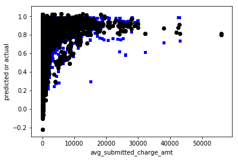


    <matplotlib.figure.Figure at 0x1733fd978>


    <matplotlib.figure.Figure at 0x1733fd978>


The fit has improved, however, the predicted values are not in [0,1] range. Using a logit transformation,


```python
with open(os.path.join(DATA_FOLDER, 'xgboost_logit.pickle'), 'rb') as handle:
    xgboost_logit_pickle = pickle.load(handle)
    
dct_model_comparison.append({'model' : 'XGBoost (Logit)',
                             'mse': mean_squared_error(Y_Test, xgboost_logit_pickle['xgboost_preds']),
                             'r2_score': r2_score(Y_Test, xgboost_logit_pickle['xgboost_preds'])})

r2_score(Y_Test, xgboost_logit_pickle['xgboost_preds'])
```


    0.68614315940368864


```python
plt.xlabel("avg_submitted_charge_amt")
plt.ylabel("predicted or actual")
plt.scatter(X_Test['avg_submitted_charge_amt'], Y_Test, s=10, c='b', marker="s")
plt.scatter(X_Test['avg_submitted_charge_amt'], xgboost_logit_pickle['xgboost_preds'],color='black')

plt.show()
plt.figure()
```


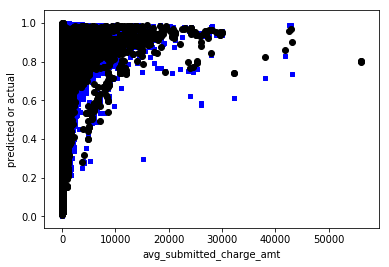


    <matplotlib.figure.Figure at 0x173425208>


    <matplotlib.figure.Figure at 0x173425208>


The fit seems to have improved a bit and the predicted target values are also well within the range.

# Deep Neural Network Regression

I use TensorFlow to build a deep neural network model to predict overcharge ratio. I use three layers with 1024 filters in each layer. Due to the time and computation resources taken to train my model, I do not experiment with activation functions and stick with ReLU. I see this as a learning exercise to get hands on with TensorFlow and do not expect to see drastic performance improvements without parameter tuning.

I use the built in DNNRegressor function to train my model. I overload its feature input function with custom feature transformers to deal with continuous and categorical variables.


```python
def nnet_cat_num_split(df, target_col):

    df_numerical = df.select_dtypes(exclude=['object'])
    df_numerical.fillna(-1, inplace=True)

    df_categoric = df.select_dtypes(include=['object'])
    df_categoric.fillna('NONE', inplace=True)

    df = df_numerical.merge(df_categoric, left_index=True, right_index=True)

    return df, df_numerical, df_categoric

def scale_and_preprocess(train_numerical, test_numerical, Y_Test, target_col):
    col_train_num = list(train_numerical.columns)
    col_train_num_bis = list(train_numerical.columns)


    col_train_num_bis.remove(target_col)

    mat_train = np.matrix(train_numerical)
    mat_test = np.matrix(test_numerical)
    mat_new = np.matrix(train_numerical.drop(target_col, axis=1))
    mat_y = np.array(train_numerical[target_col])

    mat_test_y = np.array(Y_Test)

    prepro_y = RobustScaler(with_centering=False)
    prepro_y.fit(mat_y.reshape(mat_y.shape[0], 1))

    transformed_y = pd.DataFrame(prepro_y.transform(mat_test_y.reshape(mat_test_y.shape[0], 1)), columns=[target_col])

    prepro = RobustScaler(with_centering=False)
    prepro.fit(mat_train)

    prepro_test = RobustScaler(with_centering=False)
    prepro_test.fit(mat_new)

    train_num_scale = pd.DataFrame(prepro.transform(mat_train), columns=col_train_num)
    test_num_scale = pd.DataFrame(prepro_test.transform(mat_test), columns=col_train_num_bis)

    return train_num_scale, test_num_scale, transformed_y, col_train_num, col_train_num_bis, prepro, prepro_y, prepro_test

def get_nnet_model(df_claims, test_size, seed):

    LABEL = 'overcharge_ratio'

    X_Train, X_Test, Y_Train, Y_Test = get_train_test(df_claims, test_size, seed)

    train = pd.concat([X_Train, Y_Train], axis=1)
    train = train.reset_index(drop=True)

    test = pd.concat([X_Test], axis=1)
    test = test.reset_index(drop=True)

    train, train_numerical, train_categoric = nnet_cat_num_split(train, LABEL)
    train, test_numerical, test_categoric = nnet_cat_num_split(test, LABEL)

    col_train_cat = list(train_categoric.columns)

    train_num_scale, test_num_scale, test_y, col_train_num, col_train_num_bis, prepro, prepro_y, prepro_test = scale_and_preprocess(train_numerical, test_numerical, Y_Test, LABEL)

    train[col_train_num] = train_num_scale
    test[col_train_num_bis] = test_num_scale

    COLUMNS = col_train_num
    FEATURES = col_train_num_bis

    FEATURES_CAT = col_train_cat

    engineered_features = []

    for continuous_feature in FEATURES:
        engineered_features.append(
            tf.contrib.layers.real_valued_column(continuous_feature))

    for categorical_feature in FEATURES_CAT:
        sparse_column = tf.contrib.layers.sparse_column_with_hash_bucket(
            categorical_feature, hash_bucket_size=1000)

        engineered_features.append(
            tf.contrib.layers.embedding_column(sparse_id_column=sparse_column, dimension=16, combiner="sum"))


    training_set = train

    training_set[FEATURES_CAT] = training_set[FEATURES_CAT].applymap(str)
    test[FEATURES_CAT] = test[FEATURES_CAT].applymap(str)

    testing_set = pd.concat([test, test_y], axis=1)

    def input_fn_new(data_set, training=True):
        continuous_cols = {k: tf.constant(data_set[k].values) for k in FEATURES}

        categorical_cols = {k: tf.SparseTensor(
            indices=[[i, 0] for i in range(data_set[k].size)], values=data_set[k].values,
            dense_shape=[data_set[k].size, 1]) for k in FEATURES_CAT}

        
        feature_cols = dict(list(continuous_cols.items()) + list(categorical_cols.items()))

        if training == True:
            label = tf.constant(data_set[LABEL].values)
            return feature_cols, label

        return feature_cols

   
    regressor = tf.contrib.learn.DNNRegressor(feature_columns=engineered_features,
                                              activation_fn=tf.nn.relu, hidden_units=[1024, 1024, 1024],
                                              model_dir=os.path.join(DATA_FOLDER, 'nnet_model_new'))

    
    regressor.fit(input_fn=lambda: input_fn_new(training_set), steps=2000)

    y = regressor.predict(input_fn=lambda: input_fn_new(test, training=False))
    predictions = list(itertools.islice(y, test.shape[0]))
    predictions_transformed = prepro_y.inverse_transform(np.array(predictions).reshape(test.shape[0], 1))

    result = {
              'nnet_preds': predictions,
              'nnet_test_y': Y_Test,
              'y_predict_transformed': predictions_transformed
              }

    return result
```


```python
with open(os.path.join(DATA_FOLDER, 'nnet_model_1.pickle'), 'rb') as handle:
    nnet_pickle = pickle.load(handle)
```


```python
dct_model_comparison.append({'model' : 'NNet',
                             'mse': mean_squared_error(Y_Test, nnet_pickle['y_predict_transformed']),
                             'r2_score': r2_score(Y_Test, nnet_pickle['y_predict_transformed'])})

r2_score(nnet_pickle['nnet_test_y'], nnet_pickle['y_predict_transformed'])
```


    -12.328748877269696


I suspect the possible reasons for worse performance to be,

1. Too low learning rate (Underfitting)
2. Overfitting (Too many filters)

Next steps to improve this could be using an exponential learning rate, using drop out to prune features and experimenting with optimizers and activation functions. For now, I would stick the tree based learners and linear regression.

# Model Comparison and conclusion

The objective of this study was to see if machine learning models can help identify hidden patterns in claims which might be too expensive to track with traditional business models. We explored the distribution of service codes across physicians, and was able to see anomalies. This can be extended with comparison of price deviation from average prices of the services, to identify odd prices, and can act as a starting point for further investigation.

As regards the regression models, I was able to achieve the highest accuracy of 0.69 with an XGBoostRegressor. I believe that with further tuning of hyperparameters, the accuracy can be improved. The Random Forest regressor can be made more dense and can also experiment with a wider range of values for XGBoost parameters, with more computing resources. 


```python
pd.DataFrame(dct_model_comparison).sort_values(['r2_score'], ascending=0).reset_index(drop=True)
```


<div>
<style>
    .dataframe thead tr:only-child th {
        text-align: right;
    }

    .dataframe thead th {
        text-align: left;
    }

    .dataframe tbody tr th {
        vertical-align: top;
    }
</style>
<table border="1" class="dataframe">
  <thead>
    <tr style="text-align: right;">
      <th></th>
      <th>model</th>
      <th>mse</th>
      <th>r2_score</th>
    </tr>
  </thead>
  <tbody>
    <tr>
      <th>0</th>
      <td>XGBoost (Logit)</td>
      <td>0.011679</td>
      <td>0.686143</td>
    </tr>
    <tr>
      <th>1</th>
      <td>XGBoost</td>
      <td>0.012347</td>
      <td>0.668205</td>
    </tr>
    <tr>
      <th>2</th>
      <td>RForest</td>
      <td>0.017023</td>
      <td>0.542525</td>
    </tr>
    <tr>
      <th>3</th>
      <td>Logit Regression</td>
      <td>0.025800</td>
      <td>0.306661</td>
    </tr>
    <tr>
      <th>4</th>
      <td>Linear Regression</td>
      <td>0.027855</td>
      <td>0.251440</td>
    </tr>
    <tr>
      <th>5</th>
      <td>NNet</td>
      <td>0.029234</td>
      <td>0.214379</td>
    </tr>
  </tbody>
</table>
</div>


# Appendix

* [Github code repository](https://github.com/TavoloPerUno/medicare_claims)


```python

```
